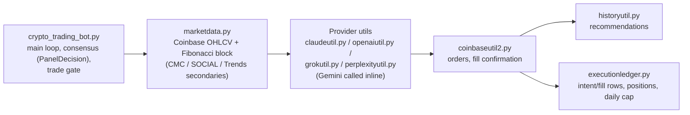

# Trading Bot Repository Guide

A comprehensive cryptocurrency trading system combining AI-powered analysis, multi-exchange support, correlation-based strategies, and arbitrage detection.

---

## Overview

This repository contains multiple interconnected projects for cryptocurrency trading and analysis:

- **AI-Powered Trading** - Multi-LLM consensus-based trading recommendations
- **Correlation Analysis** - Discover leading indicator relationships between tokens
- **Cross-Exchange Arbitrage** - Exploit price discrepancies across exchanges and chains
- **Liquidity Pool Arbitrage** - Trade LP token premium/discount spreads
- **DEX Integration** - Native Solana trading via Jupiter aggregator

---

## Quick Start

```bash
# Create a virtualenv and install dependencies
python3 -m venv venv
./venv/bin/pip install -r requirements.txt
./venv/bin/pip install -r requirements_dev.txt   # only needed to run tests
# Feature extras (install if you use the feature):
#   requirements_correlation_tracker.txt -- correlation_tracker.py; without it
#     the Granger causality test is skipped (statsmodels)
#   requirements_dex.txt                 -- DEX / Solana trading
#   requirements_llm_compare.txt         -- standalone llm_compare.py

# Set API keys: copy .env.example to .env and fill in your keys
cp .env.example .env
# .env loads automatically at startup; shell `export`s still work and take
# precedence over .env values.

# Coinbase credentials file (required even for what-if runs -- the bot
# constructs the Coinbase client unconditionally on startup). Download this
# from the Coinbase Developer Platform and place it at the repo root:
#   cdp_api_key.json

# Run main trading bot in what-if / simulation mode -- no real trades.
# HISTORY_DIR redirects history output away from the repo's history/ dir,
# which is recommended for first runs. --llm-mode=gemini uses a single LLM
# (one API key); drop it to use the full 5-model consensus panel.
HISTORY_DIR=/tmp/tradbot_scratch ./venv/bin/python crypto_trading_bot.py --trading-mode=whatif --llm-mode=gemini --coins=BTC
```

### Trading mode & the live-trading double lock

The bot now defaults to **what-if (simulation)** mode. Live trading is
double-locked and requires **both**:

1. the `--live` command-line flag, **and**
2. the environment variable `LIVE_TRADING_CONFIRMED=1`.

```bash
# Live trading (executes REAL orders): BOTH locks required
LIVE_TRADING_CONFIRMED=1 python crypto_trading_bot.py --live --llm-mode compare
```

`LIVE_TRADING_CONFIRMED` **must be set in the shell per invocation** (as above).
If it appears in `.env` it is stripped and ignored, and the bot prints a
`[LIVE LOCK]` notice — a checked-in config file can never arm live trading.

Any live request that is missing either lock is automatically downgraded to
what-if, and the bot prints a loud notice explaining what was missing. Trade
sizing is also configurable and capped:

- `--notional-usd` (env `TRADE_NOTIONAL_USD`, default `5.00`, hard ceiling
  `100.00`) — USD per buy order (CEX and DEX).
- `--run-spend-cap-usd` (env `RUN_SPEND_CAP_USD`, default `10.00`) — maximum
  cumulative intended spend across all buys in one run; buys that would exceed
  it are refused (what-if spend counts against the cap too).
- `--daily-spend-cap-usd` (env `DAILY_SPEND_CAP_USD`, default `15.00`) —
  maximum cumulative intended **live** spend across all runs in a single UTC
  day, summed from the execution ledger; a live buy that would exceed it is
  refused with `[DAILY CAP]`. What-if spend does not count against this cap.

> **Migration note (breaking change):** `--trading-mode=live` (or
> `TRADING_MODE=live`) **alone no longer enables live trading**. The
> `--trading-mode` flag value is still accepted for compatibility, but live
> now requires the `--live` flag **and** `LIVE_TRADING_CONFIRMED=1`. Scripts
> that previously relied on `--trading-mode=live` will run in what-if until
> updated. The default with no flags is now what-if (previously live).

### What each recommendation is based on

Every coin analysis is grounded in a compact, plainly-labeled data block
built fresh each run and prepended to every panelist's prompt (see
`marketdata.py`):

- **MARKET DATA** (Coinbase OHLCV, primary) — last price, 24h/72h/7d change,
  range, volume trend, and volatility, verifiable by every panelist from the
  same candles.
- **FIBONACCI** — retracement levels computed from that same OHLCV window.
- **CMC** (CoinMarketCap) — rank, market-cap dominance, supply, and
  multi-window % change. Resolved by CoinMarketCap numeric ID rather than
  ticker symbol where possible, so a colliding ticker can't silently return
  a different asset's numbers.
- **SOCIAL** (LunarCrush) — galaxy score, alt rank, an interaction-weighted
  sentiment aggregate, and social volume.
- **GOOGLE TRENDS** — a secondary signal only (search interest, not price);
  it's noisy on low-volume tickers, so it never carries the analysis alone.

Any of the above that can't be fetched is disclosed explicitly (e.g. `CMC
DATA UNAVAILABLE: <reason>`) — never silently omitted, and never invented.

### How the panel decides

Each LLM votes with a schema-enforced JSON object (`symbol`, `action`,
`confidence`, `abstain`, `reasons`) instead of free-text scraped for
keywords, so a model's refusal or hedge can't be misread as a BUY. In
`compare`/`integrate` mode with `--require-consensus=true` (the default), a
trade only happens when every panelist agrees; any parse failure, refusal,
API error, or symbol mismatch counts as an abstain, and the panel **fails
closed** — it never shrinks the quorum or falls back to a single model's
opinion to force a decision.

### Scoring past recommendations

`tradeanalyzer.py` grades recorded whatif/live recommendations against
BTC-relative benchmark returns (never a backtester or simulated P&L — it
only compares a recorded decision to observed prices). See
[docs/RUNBOOK_whatif_cadence.md](docs/RUNBOOK_whatif_cadence.md) for running
the bot on a schedule to accumulate data for it to grade, and
[docs/RUNBOOK_live_acceptance.md](docs/RUNBOOK_live_acceptance.md) for the
owner-executed live acceptance test.

See [OPERATIONS_MANUAL.md](OPERATIONS_MANUAL.md) for detailed configuration.

---

## Projects

| Project | Description | Design Doc | Operations Manual | Status | Main Module | Comments |
|---------|-------------|------------|-------------------|--------|-------------|----------|
| **Crypto Trading Bot** | AI-powered trading using multi-LLM consensus | [AGENTS.md](AGENTS.md) / [OPERATIONS_MANUAL.md](OPERATIONS_MANUAL.md) (current) — [design doc, superseded](docs/design/CRYPTO_TRADING_BOT.md) | [OPERATIONS_MANUAL.md](OPERATIONS_MANUAL.md) | ✅ Implemented | `crypto_trading_bot.py` | Core system - Gemini, Claude, OpenAI, Grok, Perplexity |
| **LLM Compare** | Multi-LLM comparison and integration framework | [README_LLM_COMPARE.md](README_LLM_COMPARE.md) (current) — [design doc, superseded](docs/design/LLMCompareFeature.md) | [LLM_COMPARE_OPERATIONS_MANUAL.md](LLM_COMPARE_OPERATIONS_MANUAL.md) | ✅ Implemented | `llm_compare.py` | General-purpose LLM comparison tool |
| **Correlation Tracker** | Intraday price collection and leading indicator discovery | [CORRELATION_HISTORY_TRACKER.md](CORRELATION_HISTORY_TRACKER.md) | [CORRELATION_HISTORY_OPERATIONS_MANUAL.md](CORRELATION_HISTORY_OPERATIONS_MANUAL.md) | ✅ Implemented | `correlation_tracker.py` | Collect mode + Analyze mode |
| **Leading Indicator Tester** | Paper trading simulation for correlation pairs | [LEADING_INDICATOR_PERFORMANCE_TESTER.md](LEADING_INDICATOR_PERFORMANCE_TESTER.md) | — | ✅ Implemented | `leading_indicator_tester.py` | Cross-exchange arbitrage investigation |
| **DEX Trading** | Solana DEX trading via Jupiter aggregator | [DEX_TRADING_FEATURE.md](DEX_TRADING_FEATURE.md) | — | ✅ Implemented | `dex/jupiterutil.py` | Wallet connect, token swaps, price API |
| **Liquidity Pool Arbitrage** | JLP premium/discount arbitrage on Jupiter | [LIQUIDITY_POOL_FEATURE.md](LIQUIDITY_POOL_FEATURE.md) | [LIQUIDITY_POOL_OPERATIONS_MANUAL.md](LIQUIDITY_POOL_OPERATIONS_MANUAL.md) | ✅ Implemented | `lp_arbitrage.py` | Also supports HyperLiquid, Drift |
| **Correlated Pair Trading** | Cross-exchange arbitrage for wrapped tokens | [CORRELATED_PAIR_FEATURE.md](docs/design/CORRELATED_PAIR_FEATURE.md) | — | 📋 Design Only | — | TAO/WTAO, BTC/WBTC strategies |
| **Flash Loan Arbitrage** | Atomic arbitrage using flash loans | [FLASH_LOAN_FEATURE.md](docs/design/FLASH_LOAN_FEATURE.md) | — | 📋 Design Only | — | Zero-capital atomic trades |
| **Meteora Arbitrage** | DLMM bin arbitrage on Meteora | [METEORA_ARBITRAGE_FEATURE.md](docs/design/METEORA_ARBITRAGE_FEATURE.md) | — | 📋 Design Only | — | Solana concentrated liquidity |

---

## Feature Enhancements

| Feature | Description | Design Doc | Status | Module | Comments |
|---------|-------------|------------|--------|--------|----------|
| **Coin Categorization** | Filter coins by category (meme, DeFi, AI) | [COIN_CATEGORIZATION_FEATURE.md](COIN_CATEGORIZATION_FEATURE.md) | ✅ Implemented | `lunarcrushutil.py` | Uses LunarCrush API |
| **Coin Choice** | Analyze specific coins directly | [COIN_CHOICE_FEATURE.md](COIN_CHOICE_FEATURE.md) | ✅ Implemented | `crypto_trading_bot.py` | `--coins` flag or `ANALYZE_COINS` env |
| **Compare with Bitcoin** | Evaluate altcoin alpha vs BTC | [COMPARE_WITH_BITCOIN_FEATURE.md](docs/design/COMPARE_WITH_BITCOIN_FEATURE.md) | 📋 Design Only | — | Risk-adjusted comparison |
| **History Analysis** | Track and analyze recommendation accuracy | [HISTORY_ANALYSIS_FEATURE.md](HISTORY_ANALYSIS_FEATURE.md) | ✅ Implemented | `historyutil.py` | Performance metrics by LLM |
| **LunarCrush Integration** | Social intelligence data for coins | [LUNAR_CRUSH_FEATURE.md](LUNAR_CRUSH_FEATURE.md) | ✅ Implemented | `lunarcrushutil.py` | Categories, blockchains, sentiment |
| **Polymarket Integration** | Prediction market sentiment data | [POLYMARKET_FEATURE.md](POLYMARKET_FEATURE.md) | ✅ Implemented | `polymarketutil.py` | Market-validated coin selection |
| **Stock Trading** | Extend bot to Coinbase stock trading | [STOCK_TRADING_FEATURE.md](docs/design/STOCK_TRADING_FEATURE.md) | 📋 Design Only | — | US equities via Coinbase |
| **Whale Alert** | Large transaction tracking | [WHALE_ALERT_INTEGRATION_FEATURE.md](docs/design/WHALE_ALERT_INTEGRATION_FEATURE.md) | 📋 Design Only | — | Exchange inflow/outflow signals |
| **What-If Mode** | Paper trading / simulation mode | [WHAT_IF_MODE_FEATURE.md](WHAT_IF_MODE_FEATURE.md) | ✅ Implemented | `crypto_trading_bot.py` | `--trading-mode whatif` |

---

## Internal Documentation

| Document | Purpose |
|----------|---------|
| [AGENTS.md](AGENTS.md) | **Start here for AI-assisted development** — hard rules, environment, architecture map, API gotchas (any agent: Devin/Windsurf/Codex/Grok/Claude) |
| [MODELS.md](MODELS.md) | LLM model registry, migration history, per-provider request/response shapes |
| [docs/RUNBOOK_whatif_cadence.md](docs/RUNBOOK_whatif_cadence.md) | Scheduled what-if runs that feed `tradeanalyzer.py`'s benchmark-relative scoring |
| [docs/RUNBOOK_live_acceptance.md](docs/RUNBOOK_live_acceptance.md) | Owner-executed live acceptance test (the one supervised real trade) |
| [docs/archive/INSTRUCTIONS_FOR_IMPLEMENTATION.md](docs/archive/INSTRUCTIONS_FOR_IMPLEMENTATION.md) | Guidelines for implementing features (historical) |
| [METHODS_OF_SPECIFYING_RUNTIME_OPTIONS.md](METHODS_OF_SPECIFYING_RUNTIME_OPTIONS.md) | CLI vs env var configuration patterns |
| [PARSING_OPTIONS_FOR_VARIABLE_INPUT.md](PARSING_OPTIONS_FOR_VARIABLE_INPUT.md) | Handling variable LLM output formats |
| [docs/design/GENERAL_PURPOSE_LLM_COMPARE_AND_INTEGRATE_FEATURE.md](docs/design/GENERAL_PURPOSE_LLM_COMPARE_AND_INTEGRATE_FEATURE.md) | Abstracted multi-LLM framework design (superseded — see [README_LLM_COMPARE.md](README_LLM_COMPARE.md)) |

---

## Directory Structure

```
tradbot/
├── crypto_trading_bot.py      # Main trading bot
├── llm_compare.py            # General-purpose LLM comparison
├── correlation_tracker.py    # Price collection & correlation analysis
├── leading_indicator_tester.py # Paper trading for correlation pairs
├── lp_arbitrage.py           # Liquidity pool arbitrage
├── lp_analyzer.py            # LP analysis utilities
│
├── dex/                      # DEX integration (Solana/Jupiter)
│   ├── jupiterutil.py        # Jupiter API client
│   ├── token_cache.py        # Token mint address cache
│   ├── local_wallet.py       # Solana wallet management
│   └── walletconnect.py      # WalletConnect integration
│
├── llm_utils/                # LLM client wrappers
│   ├── claude_client.py
│   ├── gemini_client.py
│   ├── openai_client.py
│   ├── grok_client.py
│   └── perplexity_client.py
│
├── history/                  # Recommendation history tracking (gitignored allowlist; per-user data written at runtime)
├── live_trades/               # Live trade fill logs (gitignored, per-user, created at runtime)
├── context/                  # Google Trends integration
├── prompts/                  # LLM prompt templates
├── correlation_data/         # Price history storage (gitignored, created at runtime)
└── lab/                      # Experimental scripts
```

### Runtime path

The diagram below restates the prose architecture map in
[AGENTS.md](AGENTS.md) (see "Architecture map (runtime path vs the rest)") —
no new information, just a visual of the same path.



---

## API Integrations

| API | Purpose | Module | Required |
|-----|---------|--------|----------|
| **Coinbase** | CEX trading + OHLCV candles for the market data block | `coinbaseutil2.py`, `marketdata.py` | Always (client is constructed even in what-if mode; real orders need live trading armed — see above) |
| **Jupiter** | Solana DEX | `dex/jupiterutil.py` | For DEX trading |
| **CoinGecko** | Price data | `coingeckoutil.py` | Free tier available |
| **CoinMarketCap** | Rank, dominance, supply, %-change (CMC section of the market data block) | `coinmarketcaputil.py`, `marketdata.py` | Free tier (15k credits/mo) |
| **LunarCrush** | Social data, categories, and the SOCIAL section of the market data block | `lunarcrushutil.py`, `marketdata.py` | Individual plan, $24/month |
| **Polymarket** | Prediction markets | `polymarketutil.py` | Free |
| **Santiment** | On-chain metrics | `santimentutil.py` | Free tier |
| **Google Trends** | Search trends; a secondary signal in `crypto_trading_bot.py`'s market data block (own `pytrends` usage), also used by `llm_compare.py` | `context/trends.py` | Free |

---

## Status Legend

| Symbol | Meaning |
|--------|---------|
| ✅ Implemented | Feature is coded and functional |
| 📋 Design Only | Design document exists, not yet implemented |
| 🚧 In Progress | Partially implemented |

---

## Getting Started by Use Case

### I want to trade crypto with AI recommendations
→ Start with [OPERATIONS_MANUAL.md](OPERATIONS_MANUAL.md) and `crypto_trading_bot.py`

### I want to find correlated trading pairs
→ See [CORRELATION_HISTORY_TRACKER.md](CORRELATION_HISTORY_TRACKER.md) and run `correlation_tracker.py`

### I want to test a correlation strategy
→ See [LEADING_INDICATOR_PERFORMANCE_TESTER.md](LEADING_INDICATOR_PERFORMANCE_TESTER.md) for paper trading

### I want to trade on Solana DEX
→ See [DEX_TRADING_FEATURE.md](DEX_TRADING_FEATURE.md) and the `dex/` module

### I want to arbitrage LP tokens
→ See [LIQUIDITY_POOL_FEATURE.md](LIQUIDITY_POOL_FEATURE.md) and `lp_arbitrage.py`

### I want to compare multiple LLMs on any question
→ See [README_LLM_COMPARE.md](README_LLM_COMPARE.md) and `llm_compare.py`

---

**License:** private, all rights reserved.
